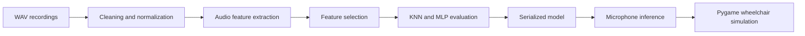

# Voice-Controlled Wheelchair

Machine-learning prototype that recognizes spoken movement commands and uses
them to control a wheelchair in an interactive simulation. The project covers
the complete audio-classification pipeline: signal exploration, feature
engineering, model selection, evaluation and a real-time microphone demo.

> This is an academic software simulation. It is not certified or suitable for
> controlling a real mobility device.

## Supported commands

The classifier works with seven audio classes:

| Audio class | Simulation action |
| --- | --- |
| `forward` | Move forward |
| `backward` | Move backward |
| `left` | Turn left |
| `right` | Turn right |
| `stop` | Stop movement |
| `_silence_` | Ignore silence/background |
| `_unknown_` | Reject unsupported words |

## Project pipeline



The notebook implements the following stages:

1. Dataset inspection, class-distribution analysis and WAV normalization.
2. Duration and amplitude analysis, with Z-score, IQR, K-Means and DBSCAN
   approaches to outlier detection.
3. Extraction of time-domain, frequency-domain, STFT, MFCC and wavelet
   features.
4. Statistical tests and feature selection with PCA, Fisher Score and ReliefF.
5. Train/test, train/validation/test and stratified K-fold evaluation.
6. Hyperparameter comparison for K-Nearest Neighbours and scikit-learn MLP.
7. Implementation of a neural network and backpropagation from scratch for
   learning purposes.
8. Real-time inference from the microphone in a Pygame maze simulation.

## Technologies

- Python and Jupyter Notebook
- NumPy, pandas and SciPy
- librosa and PyWavelets for audio/signal processing
- scikit-learn for preprocessing, feature selection and classification
- Matplotlib for exploratory analysis and evaluation
- sounddevice for microphone input
- Pygame for the interactive simulation

## Repository structure

```text
Voice_controlled_Wheelchair/
├── project.ipynb      # Analysis, training, evaluation and simulation
├── requirements.txt   # Python dependencies
└── README.md
```

The audio dataset and generated model files are intentionally not included in
this repository.

## Local setup

### 1. Create an environment

```bash
git clone https://github.com/josepedrocunhazzz/voice_controlled_wheelchair.git
cd voice_controlled_wheelchair
python3 -m venv .venv
source .venv/bin/activate
python -m pip install --upgrade pip
python -m pip install -r requirements.txt
```

On Windows, activate the environment with:

```powershell
.venv\Scripts\activate
```

`sounddevice` may also require PortAudio to be installed by the operating
system.

### 2. Prepare the dataset

Place the WAV files in one directory per class:

```text
dataset/
├── forward/
├── backward/
├── left/
├── right/
├── stop/
├── _silence_/
└── _unknown_/
```

The notebook currently contains the original author's absolute `dataset_path`
in several cells. Replace every assignment to `dataset_path` with the path to
your local dataset before running the analysis. The recordings are expected to
be WAV files in a structure compatible with the one above.

### 3. Run the notebook

```bash
jupyter lab project.ipynb
```

Execute the cells in order. Training creates two local artifacts used by the
real-time demo:

- `mlp_combined_model.pkl` — trained classifier;
- `feature_statistics.pkl` — normalization statistics.

The final simulation requires a graphical session, microphone permission and
a working input device.

## Evaluation notes

The notebook compares weighted F1, accuracy, precision, recall and confusion
matrices. The recorded experiments reached moderate performance with KNN and
the scikit-learn MLP. A higher raw score from the network implemented from
scratch was affected by class imbalance and predictions concentrated in only a
few classes, so it should not be interpreted as the best model.

This distinction is important for an assistive-control scenario: aggregate
accuracy alone can hide dangerous errors in less frequent commands. Per-class
recall, confusion matrices, latency and robust rejection of silence/unknown
speech are the more relevant measures for future development.

## Academic context

This project was developed as university coursework to demonstrate knowledge
of data-science workflows, digital signal processing and machine learning. The
scope is a proof of concept and simulation; deployment on physical hardware
would require real-time safety constraints, fail-safe controls, extensive user
testing and validation by assistive-technology specialists.
